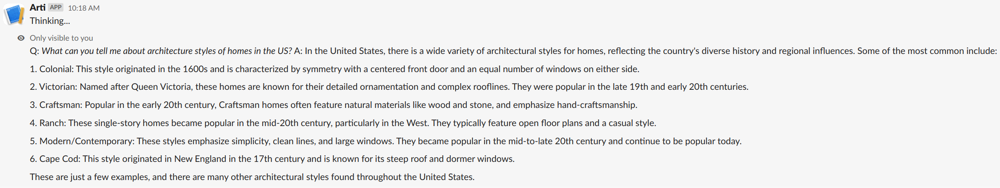
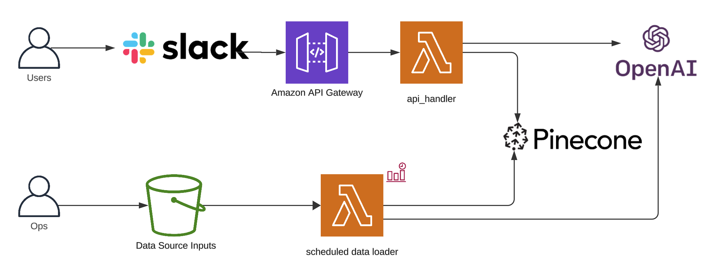

[](https://github.com/catmeme/arti)

# Arti

A serverless AI Slack bot service using Embedchain deployed to AWS Lambda using Pulumi.



Load and interrogate your data using an Artificial Intelligence [RAG](https://aws.amazon.com/what-is/retrieval-augmented-generation/) microservice built on [Embedchain](https://github.com/embedchain/embedchain), providing CLI, REST API and Slack interfaces, with an option to deploy to AWS Lambda using [Pulumi](https://pulumi.com/).

Optional configuration for various [data sources](https://docs.embedchain.ai/components/data-sources/overview), [LLMs](https://docs.embedchain.ai/components/llms), [vector databases](https://docs.embedchain.ai/components/vector-databases), [embedding models](https://docs.embedchain.ai/components/embedding-models), and [evaluation](https://docs.embedchain.ai/components/evaluation).



## Usage

### Requirements

- Docker
- Python 3

### Prerequisites

```shell
cp -R /path/to/my/assets ./assets
cp sample.env .env
```

### Quickstart

Ensure you have required dependencies installed and have followed the prerequisite steps.

Populate the `.env` file with, at minimum, the `OPENAI_API_KEY` is required for arti to answer questions.

```shell
docker compose run --rm arti ask "What do these files contain?"
```

### Manual installation

```shell
python3 -m venv venv
. venv/bin/activate
make install
arti ask "What do these files contain?"
```

## Configuration

Configuration is found in environment variables, documented in the table below.

## Local development

### Requirements

- Docker
- Python 3

### Running the application locally

1. Copy `sample.env` to `.env`, then edit `.env` to replace the sample with your desired settings:

    ```bash
    cp sample.env .env
    ```

   | Variable                       | Description                                        |
   |--------------------------------|----------------------------------------------------|
   | `AWS_REGION`                   | AWS region                                         |
   | `OPENAI_API_KEY`               | OpenAI Key (takes precedence over secret)          |
   | `OPENAI_API_KEY_SECRET_NAME`   | OpenAI Key secret name                             |
   | `PINECONE_API_KEY`             | Pinecone Key secret (takes precedence over secret) |
   | `PINECONE_API_KEY_SECRET_NAME` | Pinecone Key secret name                           |
   | `SLACK_BOT_TOKEN`              | Slack bot token (takes precedence over secret)     |
   | `SLACK_BOT_TOKEN_SECRET_NAME`  | Slack bot token secret name                        |
   | `SLACK_BOT_SIGNING_SECRET`     | Slack bot signing secret                           |
   | `LOG_LEVEL`                    | Log level                                          |

2. Create a Python virtual environment and activate it (first run only)

    ```bash
    make venv
    . venv/bin/activate
    ```

3. Configure the project for development and install dependencies

    ```bash
    make develop
    ```

4. Populate the dataset in `./assets` with files such as PDFs, Docx, CSV, HTML, Text and [more](https://docs.embedchain.ai/components/data-sources/overview)

5. Run the application

    ```bash
    arti arti ask "what can you tell me about fruits and vegetables?"
    # alternatively, run everything using docker compose
    docker compose run --rm arti ask "what can you tell me about fruits and vegetables?"
    ```

6. To stop, [CTRL]-C the application

### Pre-commit

This project implements [pre-commit](https://pre-commit.com) to manage git hooks. This isn't required, but it will help you catch any issues before you push your commits.

Install pre-commit on MacOS using Homebrew:

```bash
brew install pre-commit
```

Once you have pre-commit installed, install the git hook scripts:

```bash
pre-commit install
```

# Slack integration

The slack integration uses [Bolt](https://api.slack.com/tools/bolt).

Follow their instructions to [create a new Slack app](https://api.slack.com/start/quickstart).

For local usage, populate your `.env` file with the appropriate Slack tokens.

### Minimum scopes

For reference, these are approximately the expected scopes, depending on your use of the bot.

#### OAuth & permissions

* `chat:write`
* `channels:read`
* `commands`
* `im:read`
* `im:write`
* `users:read`
* `users:write`

#### Event subscriptions

* `message.channels`
* `message.im`

## CLI

A cli entrypoint is added as an example.  By default, the `assets` directory will be loaded into the vector database for search.

Say for example, I had a document containing information about fruits and vegetables:

```
arti ask "what can you tell me about fruits and vegetables?" 
arti -h
```

## Makefile

A `Makefile` is provided to ease some common tasks, such as linting and deploying.

To see usage instructions:

```bash
make help
```

## Deployment

Deployment happens through the [Makefile](Makefile) for convenience.  The stack configuration can be found in [deploy/pulumi](deploy/pulumi).

### Prerequisites

Create the following keys in Secrets Manager.  These names are configurable in `deploy/pulumi/Pulumi.<stack>.yaml`.  Slack and Pinecone are only necessary if they are configured for use.

| Secret Name                                               | Schema                                  |
|-----------------------------------------------------------|-----------------------------------------|
| catmeme/cloud-platform/sandbox/arti/access-token/openai   | `{ "apiKey": "" }`                      |
| catmeme/cloud-platform/sandbox/arti/access-token/pinecone | `{ "apiKey": "" }`                      |
| catmeme/cloud-platform/sandbox/arti/access-token/slack    | `{ "apiKey": "", "signingSecret": "" }` |
|                                                           |                                         |

Ensure you have a matching AWS profile name to the one in the stack.  The Makefile assumes `<environment>-deployment` 

```bash
make deploy DEPLOY_ENVIRONMENT=dev
```

The above example would expect a `dev-deployment` AWS profile configured.
